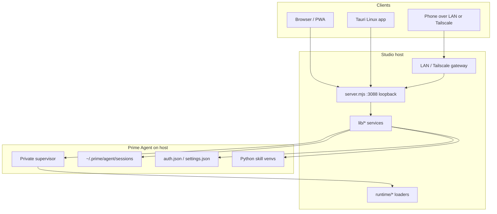

# Architecture

High-level system design for **Prime Agent Studio Nix** — a local workspace UI around Prime Agent. Keep this document aligned with the code; detailed internals live in [docs/en/development.md](docs/en/development.md).

## Purpose

Studio reunites local Prime Agent sessions in a browser (and optional Linux desktop shell): streaming responses, project/session navigation, MCP and provider management, mobile access over LAN/Tailscale, and shared project features (knowledge, roadmap, inspector).

It does **not** replace Prime Agent. Conversations, auth, models, and most tools remain native; Studio adds a GUI, metadata, and process orchestration.

## Stack

| Layer | Technology |
| --- | --- |
| Runtime | Node.js ≥ 22.8 (ESM) |
| Server | `node:http` in `server.mjs` — no Express/Fastify |
| Client | Vanilla JS/CSS in `public/` + `index.html` (no bundler) |
| Engine | Installed Prime Agent CLI / supervisor (external) |
| Python skills | Managed venvs via `uv` under `.local/kernel-venv/` |
| Desktop | Tauri 2 (`src-tauri/`) for Linux AppImage/deb / tray / updater |
| Tests | `node --test` + Playwright UI scripts under `scripts/` |

## Repository layout

```
server.mjs          HTTP app factory + route wiring
lib/                Domain modules (agent, store, MCP, LAN, files, …)
public/             Browser UI modules and assets
runtime/            In-memory loaders/hooks for Studio-spawned processes
scripts/            Launchers, UI tests, captures, desktop build helpers
test/               Unit/integration tests
src-tauri/          Rust desktop shell
desktop/            Desktop-side JS resources for packaging
docs/               FR guides; docs/en/ English twins
.local/             Runtime Studio data (gitignored)
```

## Process model



- **Loopback server** binds `127.0.0.1` (default port **3088**, override with `PORT`).
- **Remote access** is an explicit gateway with PIN auth; it does not expose provider credential routes.
- Studio starts **its own** supervisor; it does not attach to an unrelated terminal session.
- Closing a browser tab does not stop agents; **Stop** or shutting down the server does.

## Data flow (conversation turn)

1. Client `POST /api/runs` (model, thinking, attachments, optional slash command).
2. `lib/agent.mjs` launches or reuses the Studio supervisor client for that session/project.
3. Events stream over SSE (`GET /api/runs/:id/events`, supports `Last-Event-ID`).
4. Native history is written under Prime Agent’s session store; Studio metadata (pins, order, read receipts) lives in `.local/workspace.json`.
5. Live **Steer** / **Follow up** use daemon RPC via `lib/live-session-client.mjs` without creating a second session.

## Trust and security boundaries

| Boundary | Rule |
| --- | --- |
| Secrets | Provider keys and MCP OAuth tokens stay in native storage; UI sees status, not secrets |
| Origin | Host/Origin checks on local and gateway traffic |
| Path access | Project file APIs stay inside registered project roots |
| Remote | Read-only vs full-control permissions; config/provider routes stay off the remote allowlist |
| Runtime hooks | Applied only to processes Studio spawns; global npm install of Prime Agent is untouched |
| PWA cache | Icons, shell, offline page only — never conversations or attachments |

## Key subsystems

| Concern | Primary modules |
| --- | --- |
| Workspace / sessions | `lib/store.mjs`, `lib/pastudio-sessions.mjs` |
| Agent execution | `lib/agent.mjs`, `lib/daemon.mjs`, `runtime/headless-loader.mjs` |
| Live messaging | `lib/live-messages.mjs`, `lib/live-session-client.mjs` |
| Attachments | `lib/images.mjs`, `lib/files.mjs` |
| Inspector / files | `lib/session-inspector.mjs`, `lib/project-files.mjs` |
| Commands / skills | `lib/commands.mjs`, `runtime/kernel-loader.mjs` |
| MCP | `lib/mcp-config.mjs`, `lib/mcp-service.mjs` |
| Providers | `lib/provider-service.mjs`, `lib/provider-auth.mjs` |
| Remote / PWA | `lib/lan.mjs`, `lib/remote-network.mjs`, `lib/pwa.mjs`, `lib/tailscale-https.mjs` |
| Roadmap / knowledge | `lib/roadmap*.mjs`, `lib/knowledge.mjs` |
| i18n | `public/translations.js`, `public/i18n-core.js` |

## Configuration surfaces

| Location | Contents |
| --- | --- |
| `~/.prime/agent/` | Native settings, models, auth, sessions |
| `.local/` | Studio workspace, LAN PIN hash, attachments, kernel venvs, subagent defaults |
| `~/.local/share/com.primeagent.studio.nix/` | Linux desktop app data (Tauri): engine copies, webview storage, `desktop.json` |
| Browser storage | Drafts, theme, language, favorites (device-local) |
| Env vars | `PORT`, `PRIME_AGENT_CLI`, `PRIME_AGENT_*` paths — see [docs/en/configuration.md](docs/en/configuration.md) |

## Operational notes

- **No compile step** for the web UI; edit and refresh. Use a separate worktree if a live Studio is serving the same checkout.
- **Desktop builds** (`make desktop-build`) package Node + Studio for Linux (AppImage/deb); updates use Tauri minisign against `mholtzhausen/prime-agent-studio` (`make desktop-release-bootstrap` syncs the nix signing pubkey).
- **Checks**: `make check` covers JS syntax, translation table integrity, and bilingual doc fingerprints.
- **Platform**: end-user product targets Linux; the Node server and unit tests also run on that host.

## Related docs

- [AGENTS.md](AGENTS.md) — coding-agent conventions and workflows
- [docs/en/development.md](docs/en/development.md) — deep internals and test matrix
- [docs/en/desktop.md](docs/en/desktop.md) — Linux application packaging
- [docs/en/configuration.md](docs/en/configuration.md) — env vars and on-disk layout
